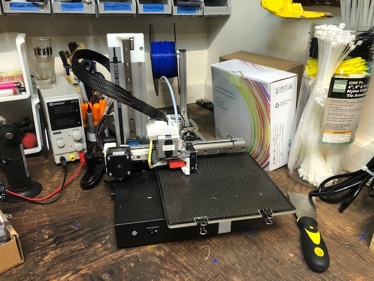
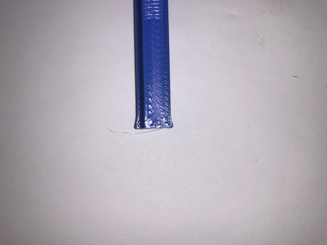
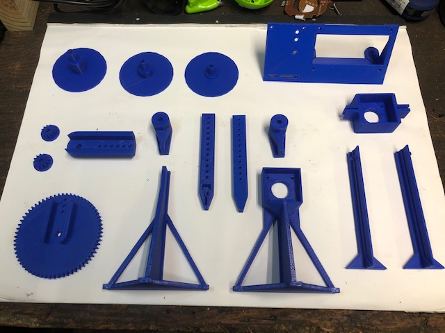

This project is really about 3D printing the components, assembling everything, then running and testing the code.  Since I have a 3D Printer, getting the physical parts made seemed like a good first step.  My 3D Printer is the Cetus3D MK3.  It has worked well so far but I haven't used it very heavily.

The files to be printed are available on [thingiverse](https://www.thingiverse.com/thing:3050437).  These parts have clearly been designed to printed without support material and I have to give Thomas the designer credit for that.  Aside from standard 3D printing challenges, the biggest issue was the build volume of my 3D printer.  The stands can be printed on a standard 20x20x20 cm cube but my printer has an 18x18x18 cm build volume.  I opted to split the stand into 2 pieces and glue them back together.  One of the stands is shown below.

The printing went smoothly.  I may try to start capturing time lapses of these prints just because they are fun to see.  It used probably a total of about 500 g of material.  These were printed in the PLA I had on hand.  My printer is well set up for PLA and I didn't want to work through tweaking the settings for use of PETG.  The problem that came up was that I was impatient during the printing and set the print speed to "fast".  The excessive speed created bulging corners shown below.  I'll have to sand those edges down to get everything to print properly.

Overall this process went smoothly.  I'm looking forward to get this physically assembled.

