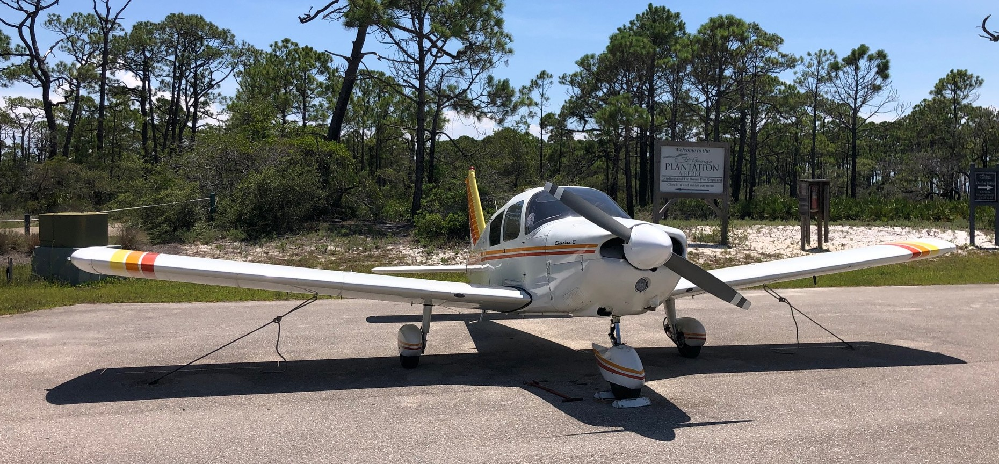
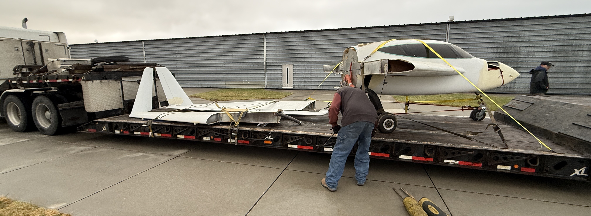

I purchased an airplane, but it needs a little work...
{/* truncate */}

## Background
In 2022, I became a certificated pilot, allowing me to fly single engine aircraft recreationally.  I have found flying to be a delightful experience.  There is still something magical about feeling the ground drop away as you take off.  Travelling is much easier when you are flying yourself.  In 2022, I owned a 1965 Piper Cherokee [PA28-180](https://en.wikipedia.org/wiki/Piper_PA-28_Cherokee).  It was a great aircraft but I kept running into 2 major issuses:

1. It was commonly about as fast as driving and less convenient if the destination was less than 180 miles away
2. It was hideously expensive and time consuming to maintain as I could not work on the aircraft myself

The best solution I could find was to find the fastest experimental (amateur built) aircraft available.  Being amateur built, I would have legal authority to work on it.  With the right choice of aircraft, I could as much as double the airspeed vs the Cherokee.  My aircraft of choice was a [Velocity](https://www.velocityaircraft.com/).  

By 2025, my Cherokee had enough hours on the engine that the manufacturer would recommend overhaul.  Not wanting to invest that scale of cost into the aircraft that was already expensive to operate, I opted to sell while the market for aircraft was still commanding high prices.

## This Aircraft - N951TM
I joined the Velocity Owners and Builders Association ([VOBA](https://voba.clubexpress.com/)) with an intent to work towards building the Velocity I wanted.  This was going to be an expensive, long term endevaour.  When you read about building an aircraft, a recurring recommendation is that you have to do it for the joy of building an aircraft, not be pushing to fly the aircraft.  My guess was that trying to build this aircraft was going to take most or all of my free time for 7+ years.  This is why these are commonly done as post retirement projects.

Early in 2026, an opportunity came across the VOBA forums.  An airframe was for sale at "Make an offer" prices.  It came without an engine or prop, had the wings and canard taken off, and was in Omaha, Nebraska.  I made an absurdly low offer and it was accepted.  I think the owner was just glad someone was inclined to take it on with an intent to get it flying again.  A buddy, my son, and I went to Nebraska and loaded it onto a truck.  It arrived in central Indiana the next day and we moved it into a storage unit.

Wish me luck.