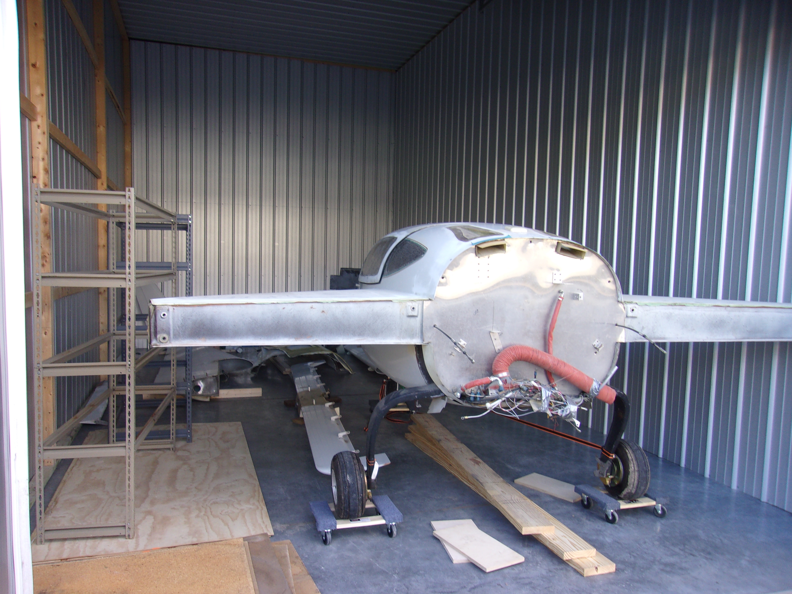
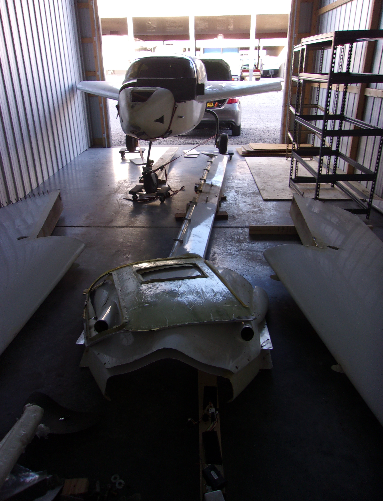
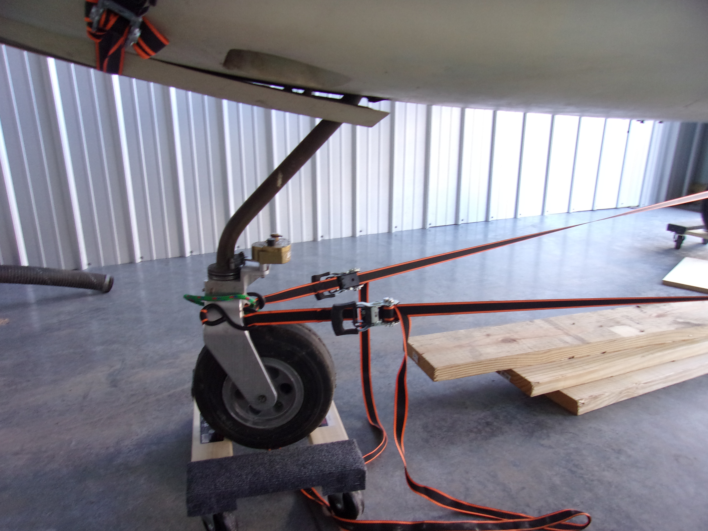
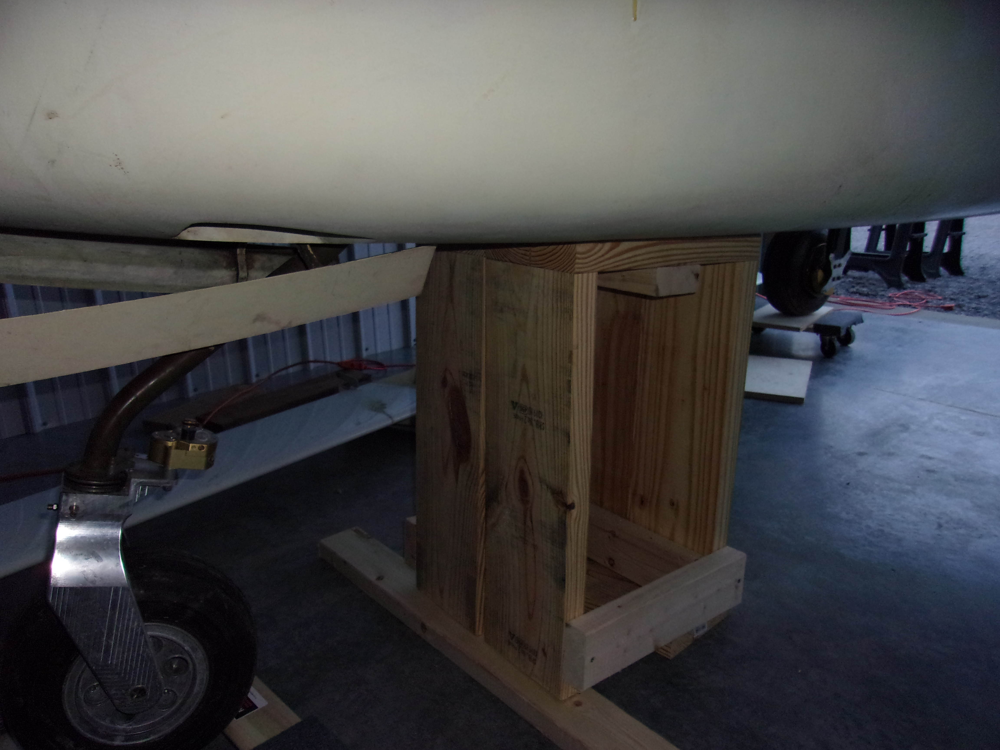

First order of business - make sure the nose gear doesn't collapse.
{/* truncate */}

## The Storage Unit
Hangars are not easy to come by.  Since one was not immediately available, I instead found a nearby self-storage facility with units available.  I will admit, that I knew the airframe was 12 ft long at the widest and still rented a 12 ft wide unit.  The door however, was only 10 ft wide.  No amount of shifting and shimmying the fuselage was going to get it to go inside.  Luckily, this facility also had a 15 ft wide unit and a 12 ft door.  This will be the airplane's new home for the near future.  The shortest waitlist for hangars was 2 years.  That may time out pretty well honestly.

## The Problem
While I did not get a pre-buy inspection, I did have some conversations with the previous owner about what would be needed to get the aircraft flying again.  I was assured that all that was needed was to install an engine/prop and bolt the control surfaces on.  Then new things got mentioned in each subsequent conversation.  I knew the avionics were partially disassembled ahead of what would have been an avionics upgrade.  I was suprised when I arrived to complete the deal and pick up the aircraft that the nose gear was at risk of collapse due to a faulty gas spring in the system.  The previous owner's was effective and simple, which was to use ratchet straps to hold the nose gear from moving forward.

Should the ratchet straps break, the nose gear will collapse and the fuselage will fall to the ground with a loud, expensive sound.  You can see the ratchet straps in the picture below.

## The Temporary Solution
To repair the landing gear, weight must be off the landing gear first.  I had some spare lumber from a failed attempt to build a jig to get the aircraft through a 10 ft door.  I used that lumber to build a fairly wide frame to take the weight of the front of the fuselage.  With the weight off, I should be able to assess and repair the front landing gear mechanism.  One part at time, this aircraft will come back together.

## Future Work
Next time, I'll be diassembling the nose gear mechanism to assess what is broken and reorganizing the workspace to make better use of the space.