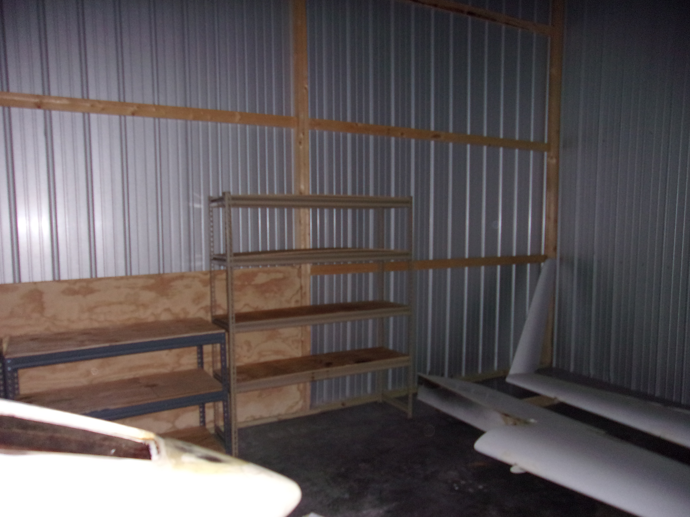

A clean workspace is a happy workspace
{/* truncate */}

## Improving the Workspace
The storage unit is pretty generous in size at 15 ft x 30 ft.  Still, the law of open spaces still applies where any open flat space will eventually be occupied.  Considering that I have only move the aircraft into the unit, the floor is pretty much occupied.  It is already a challenge to move around, so before work gets out of hand, a better system must be in place.

The wings were placed somewhat haphazardly at the time.  Putting them across the back of the storage unit will free up space in the front part of the storage unit for active work.  My loving wife saw an opporutnity for some free metal shelves and we snagged them.  She helped me get them into the storage unit the same night.  I agree with you, she is the best.

While my lease does not allow loitering, it doesn't expicitly exclude working on an airplane.  With the wings in the back of the hangar, the shelves can go along the left side since the fuselage is already biased to the right.  Once the landing gear is repaired, I'd like to flip the fueselage around to make it easier to get in and out of the unit.  One set of shelves will be split in half and the top shelves will workbenches.  Picturs of the current layout are below.

## Next Steps
It is a small, incremental step foward.  I have more evenings in July planned for aircraft work, so more progress should be had.  I'm weirdly excited about having shelves to store things.  I'm a beleive that nothing should be stored directly on the floor.