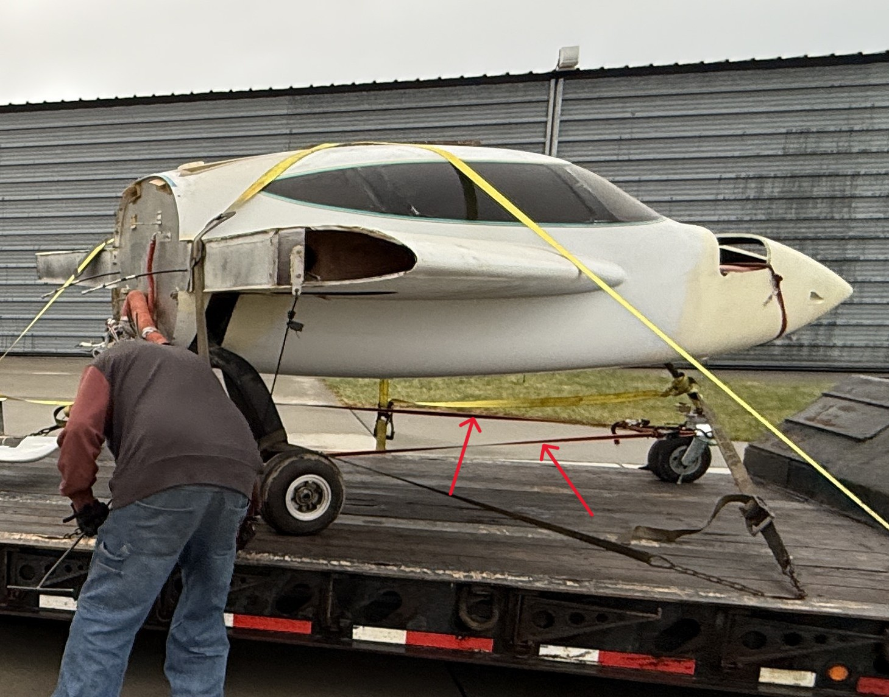
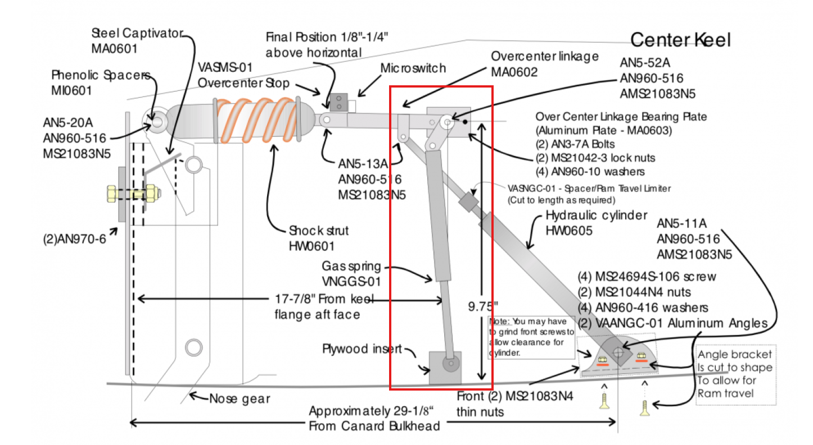
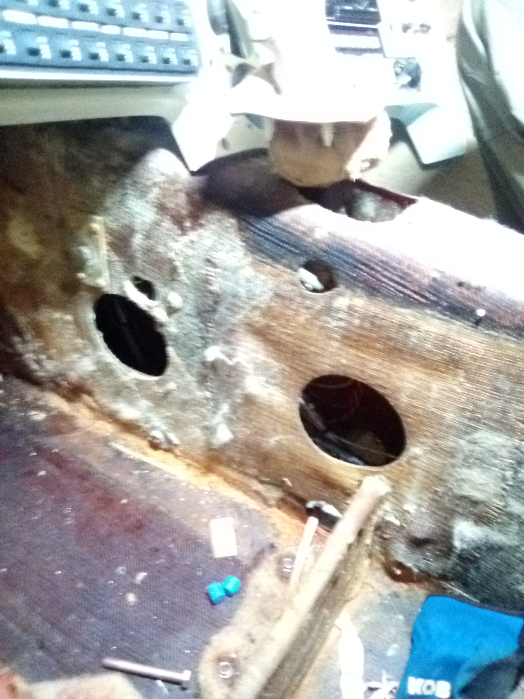

The first part replaced.
{/* truncate */}

## Tidying up The Workspace
The first order of business for these two trips to the storage unit was to get everything up off the floor and onto the shelves.  There is something satisfying about tidying up, even in a workspace.  As a knowledgeable engineer friend once told me, a clean workspace is a happy workspace.  I was glad that by the time I was done, there was plenty of room left on the shelves.  I expect that will not remain true forever.

Image of the shelves with stuff

I also cleaned out the inside of the aircraft.  There were aircraft components that had been put inside the fuselage for transport from Nebraska and a significant amount of debris from the previous owner's time working on the aircraft.  I removed a medium sized bag of trash, and discovered that there was oil leaking from a pump hanging off its wires on the firewall.  Also found a few tools - vise grips, sliding clamp, flat head screwdriver, and a rusty box cutter.  Soaked up as much oil as I could with paper towels, but need to come back with something better able to soak oil off the fiberglass.

I had to stop short of vacuuming the inside of the aircraft.  The power outlet in the storage unit is limited to 6 amps since it's intended to run a trickle charger for an RV.  Turns out my small shop vac consumes more than 6 amps or whatever the breaker actually allows.  I have a small generator that I need to get working to solve the power issue.

## Replacing the First Part
The first part to be replaced is the gas spring to lock the nose landing gear in the down position.  It was a surprise to me to learn when I arrived to pick up the aircraft from the seller that the nose landing gear would have to be strapped to the mains to keep it from collapsing.  To the seller's credit, it was a known issue and he had already procured the replacement gas spring.

The nose gear mechanism has some complexity to it, but this is the gas spring that needs to be replaced.  It's job is to keep the nose gear mechanism locked in the down position by ensuring it stays past its toggle position.

The biggest hurdle is the fact that the entire nose gear mechanism is inside of the keel of the aircraft.  That means that working on it requires working through only the holes already cut into the fiberglass.  An annoying challenge to be sure.

Thankfully, it is possible to see from above though the opening in the keel for the controls.  After much fiddling and discovering that I probably need to take up yoga to be flexible enough to work on airplanes, I was able to get the old spring out.  It is certainly busted as it provides almost no resistance to movement.  More fiddling, and the new one was mostly in place.  I couldn't fully tighten the lower gas spring mount because my wrench was too wide to fit between the body of the spring and the hex feature to keep the mount from rotating.  A custom tool will be needed.

Picture of the old spring.

## Removal of Avionics
With some extra time available, I also removed more of the old avionics.  I don't have a plan for what is going to be installed in the long term, but removing the entire panel will provide better access for work on other items.  I did not bring a set of hex keys, so I couldn't remove the radio stack.  That will be a job for a future trip.

## Next Steps
Fabrication of a tool that is narrow enough to fit on these gas spring ends.  Removal of the rest of the panel is next up as well.
