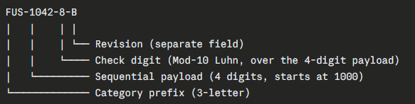
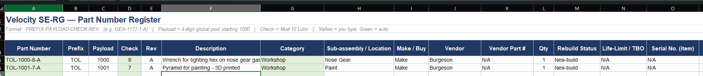
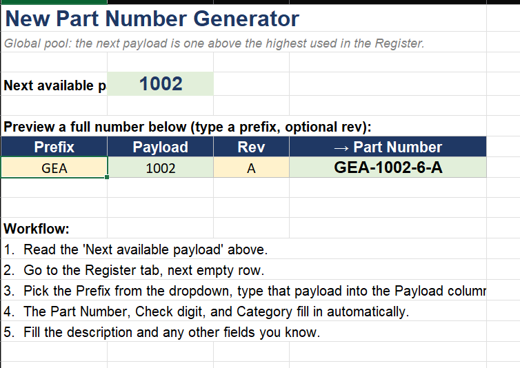
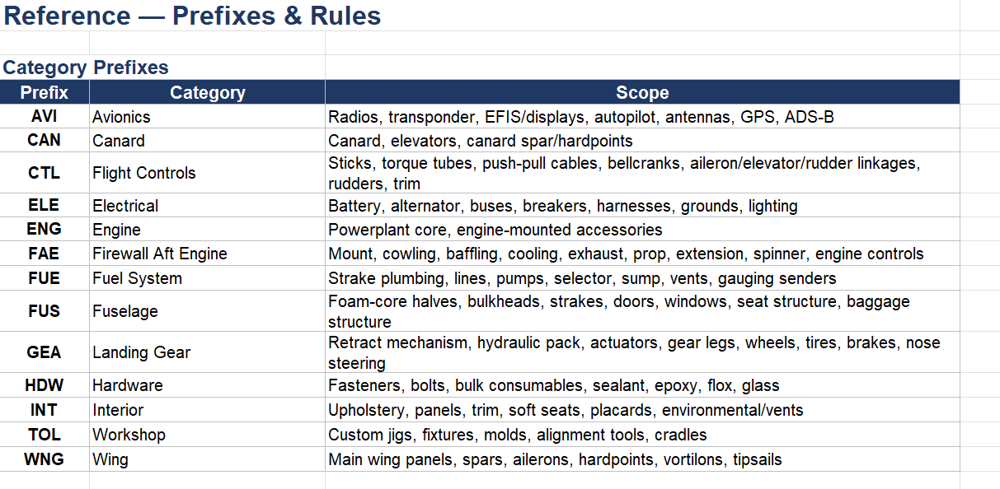
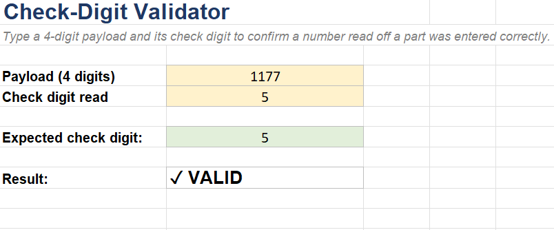
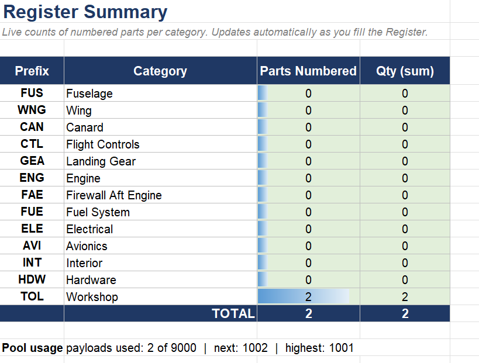

There are going to be a lot of parts - a system is needed.
{/* truncate */}

## The Motivation
The more I look at the aircraft, the more things I see that need to be done.  Those things will require parts.  How best to keep track of all of those parts?  I'm going to create a part numbering system.  It may well be overkill, and there may be established ways to do it.  But this way it can be my own.

## The Plan
This also seems like a good opportunity to use modern tools.  I need to generate a part numbering scheme, why not use a generative AI system to assist in the process?  

## Developing the System
My first question for the omniscient robot was to better understand the differences between a smart / human readable numbering system and a simple sequential numbering system.  It had good suggestions about one vs the other:  Smart systems are easier for people, but can run out of numbers within the intelligence.  Dumb numbering systems don't get bogged down in details about which part should get which number, but every number has to be looked up in a reference database to know what it is.  I'll admit that my bias was towards something in between partially because I like the organization of a smart system, but appreciate the simplicity of a sequential system.

The AI system suggested a category prefix, a part number, and a revision letter.  I liked the overall approach, but wasn't sure about how to categorize.  My initial thought was the same as the aircraft log books - airframe, engine, and prop.  That puts a tremendous number of parts in airframe.  What sort of divisions would make sense for airframe?  Again - ask the robot for suggestions.  It thought about it for a bit, did some research, and then recommended essentially the same catogries as major components in a kit.  I had some back and forth finessing the categories, and then settled on the items below.

One thing not on my radar that it brought up was a checksum value built into the number to be able to check that a given part number is valid.  Is it overkill for a numbering system with a single user that will likely never be used again?  Yes - absolutely.  But it lends credibility to the system as a whole, it is fun to try new things, and it is just the right amount of overly complicated that my engineer brain likes.  For those keeping score at home, this is a Mod-10 (Luhn) system.

## The System
The final system was more intricate than is probably needed, but I'm happy with it.

### Prefixes
A total of 13 prefixes that map to distinct parts of the aircraft to attempt to ensure no ambiguity in which parts belong to which category:
* AVI - Avionics
* CAN - Canard
* CTL - Flight Controls
* ELE - Electrical
* ENG - Engine
* FAE - Firewall Aft Engine
* FUE - Fuel System
* FUS - Fuselage
* GEA - Landing Gear
* HDW - Hardware
* INT - Interior
* TOL - Workshop, tools, & jigs
* WNG - Wing

### Part Numbers
I settled on a 4 digit part numbering system, starting at 1000 to avoid issues with 0 prefixes being truncated.  That results in about 9,000 available part numbers.  5 digits meant 90,000 part numbers which seemed excessive for a single aircraft.  3 digits meant 900 part numbers which seemed like it could be possible to run out over time.  I also opted to pull part numbers from a global pool rather than giving each category its own pool.  This does slightly defeat the purpose of the categories, but they still make it easier to read.  The global pool also makes it less likely that part numbers will get reused when they shouldn't.

### Suffixes
Two suffixes were added.  The first is the Mod-10 check sum.  The second is the revision letter for this part number.  I am sure some parts will have many revisions, but with luck most part numbers will simply have a revision letter of A.

### Putting It All Together
The final system puts it all together:

## Part Register
This was one of the most impressive parts of using an AI tool.  It rightfully suggested that I'll need a place to store these part numbers so that they can be translated into useful human readable information.  It offered to create a spreadsheet for me.  I said yes, and after about 3 minutes, a beautiful, well format excel workbook was created.  I made effectively no changes and have been using it as is. 

It generated a nice table for tracking all of the part numbers and applicable information:

It generated a tool for creating new part numbers using the next available part number:

It generated a reference page for the prefixes and other useful information:

It generated an automated tool to check the validity of a given part number.

It generated a summary page to show how many parts are used in each category:

## Going Forward
I found it delightfully easy to use the generative AI tool to build this system.  I still have reservations on using such tools leading to stagnation of useful skills.  That said, I'm sure similar concerns were raised when pocket calculators became affordable.  Now we all truly do walk around with calculators in our pocket.  The first two part numbers had nice homes inside of the tool so I'm happy to keep using the register as is.
